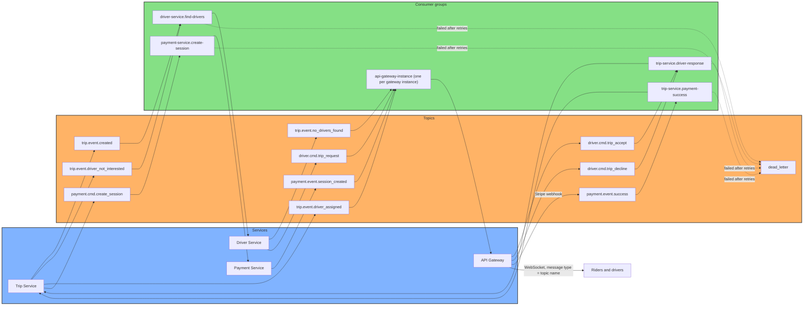

# Kafka message flow

Services talk to each other asynchronously over Kafka. Every message type has its own
topic (the topic name is the message type, e.g. `trip.event.created`), the message
key is the owner id (rider or driver) so messages of one user stay ordered, and the
value is the JSON envelope `contracts.Message{ownerId, data}`.

- Services are consumers of **consumer groups**. Replicas of a service share a group and split the partitions.
- Offsets are committed after the handler succeeded (at-least-once), so handlers must be idempotent.
- A handler that keeps failing (3 retries with backoff) gets the message moved to `dead_letter` with the failure reason in the headers (`x-death-reason`, `x-original-topic`, `x-original-partition`, `x-original-offset`, `x-retry-count`).
- Topics are created on startup by `messaging.NewKafka` (3 partitions, replication factor 1, see `KAFKA_PARTITIONS` / `KAFKA_REPLICATION_FACTOR`).
- Trace context travels in the record headers (`traceparent`), so one Jaeger trace spans publisher and consumers.

## Topics

| Topic | Published by | Consumed by (group) |
|---|---|---|
| `trip.event.created` | trip-service | driver-service (`driver-service.find-drivers`) |
| `trip.event.driver_not_interested` | trip-service | driver-service (`driver-service.find-drivers`) |
| `trip.event.no_drivers_found` | driver-service | api-gateway, pushed to the rider |
| `trip.event.driver_assigned` | trip-service | api-gateway, pushed to the rider |
| `driver.cmd.trip_request` | driver-service | api-gateway, pushed to the driver |
| `driver.cmd.trip_accept` | api-gateway (driver WebSocket) | trip-service (`trip-service.driver-response`) |
| `driver.cmd.trip_decline` | api-gateway (driver WebSocket) | trip-service (`trip-service.driver-response`) |
| `payment.cmd.create_session` | trip-service | payment-service (`payment-service.create-session`) |
| `payment.event.session_created` | payment-service | api-gateway, pushed to the rider |
| `payment.event.success` | api-gateway (Stripe webhook) | trip-service (`trip-service.payment-success`) |
| `dead_letter` | any consumer | nobody, inspect in Kafka UI |

## Delivering notifications to WebSocket users

Notification topics (`trip.event.no_drivers_found`, `trip.event.driver_assigned`,
`payment.event.session_created`, `driver.cmd.trip_request`) are read by a
`NotificationConsumer` that every API gateway instance starts once at boot. Each
instance uses its **own consumer group** (`api-gateway-<hostname>-<random>`) and
starts at the **latest** offset, so every instance sees every notification and
delivers it only if the addressed user (`ownerId`) is connected to that instance.
Other instances drop the message. Notifications for users that are not connected
are not replayed later.
