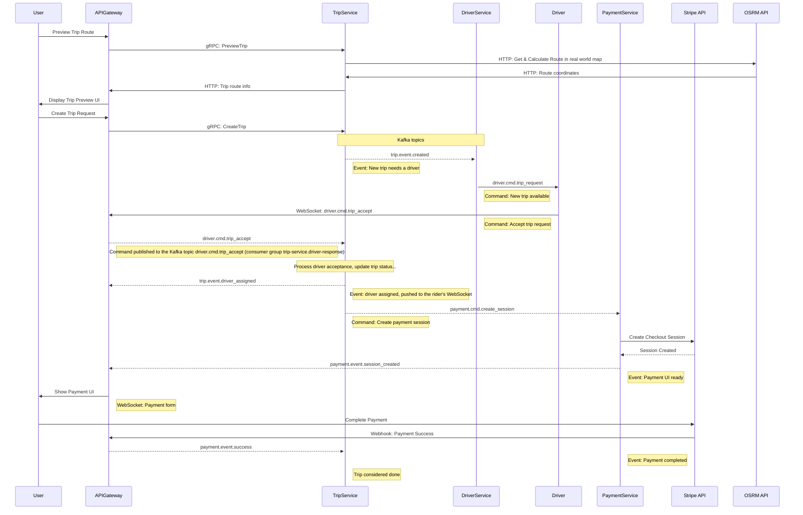

```mermaid
sequenceDiagram
  participant User as User
  participant APIGateway as APIGateway
  participant TripService as TripService
  participant DriverService as DriverService
  participant Driver as Driver
  participant PaymentService as PaymentService
  participant Stripe as Stripe API
  participant OSRM as OSRM API

  User ->> APIGateway: Preview Trip Route
  APIGateway ->> TripService: gRPC: PreviewTrip
  TripService ->> OSRM: HTTP: Get & Calculate Route in real world map
  OSRM ->> TripService: HTTP: Route coordinates
  TripService ->> APIGateway: HTTP: Trip route info
  APIGateway ->> User: Display Trip Preview UI

  User ->> APIGateway: Create Trip Request
  APIGateway ->> TripService: gRPC: CreateTrip
  Note over TripService, DriverService: Kafka topics
  TripService -->>+ DriverService: trip.event.created
  Note right of TripService: Event: New trip needs a driver
  DriverService ->> Driver: driver.cmd.trip_request
  Note right of DriverService: Command: New trip available
  Driver ->> APIGateway: WebSocket: driver.cmd.trip_accept
  Note left of Driver: Command: Accept trip request
  APIGateway -->> TripService: driver.cmd.trip_accept
  Note right of APIGateway: Command published to the Kafka topic driver.cmd.trip_accept (consumer group trip-service.driver-response)
  Note over TripService: Process driver acceptance, update trip status...
  TripService -->> APIGateway: trip.event.driver_assigned
  Note right of TripService: Event: driver assigned, pushed to the rider's WebSocket
  TripService -->> PaymentService: payment.cmd.create_session
  Note right of TripService: Command: Create payment session
  PaymentService ->> Stripe: Create Checkout Session
  Stripe -->> PaymentService: Session Created
  PaymentService -->> APIGateway: payment.event.session_created
  Note right of PaymentService: Event: Payment UI ready
  APIGateway ->> User: Show Payment UI
  Note right of APIGateway: WebSocket: Payment form
  User ->> Stripe: Complete Payment
  Stripe ->> APIGateway: Webhook: Payment Success
  APIGateway -->>+ TripService: payment.event.success
  Note right of PaymentService: Event: Payment completed

  
  Note right of TripService: Trip considered done

``` 